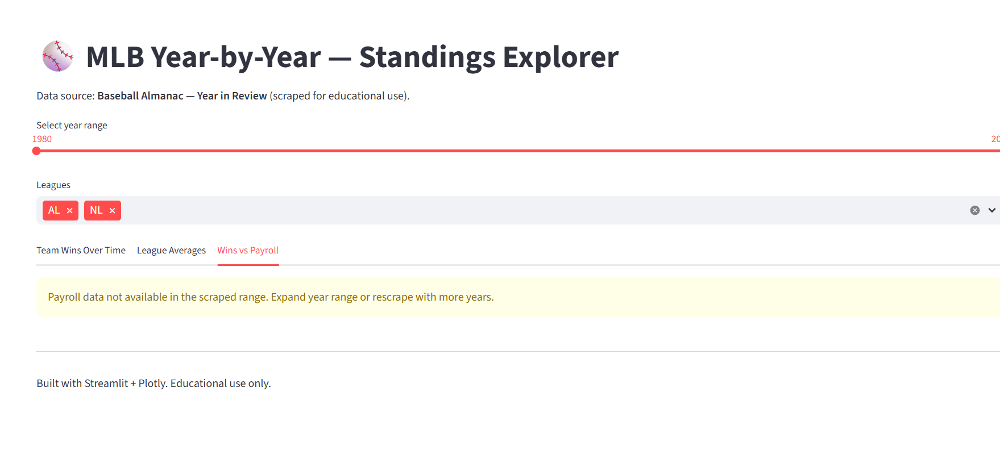

# Lesson 14 — MLB Web Scraping & Dashboard Project

This project demonstrates a complete data-engineering and data-visualization pipeline built in Python.  
It scrapes historical MLB (Major League Baseball) data from *Baseball Almanac*, cleans and stores it in a SQLite database, and presents the results in an interactive Streamlit dashboard.

---

## Overview

The project includes four main programs plus an interactive dashboard:

1. **Web Scraper (Selenium)** — collects standings data for AL/NL leagues from Baseball Almanac.  
2. **Cleaner (Pandas)** — fixes missing values, normalizes columns, and computes `win_pct`.  
3. **Importer (SQLite)** — loads each CSV into its own table (`standings_YYYY_AL/NL`).  
4. **Query CLI (SQL)** — lets you run custom joins and aggregations directly from the terminal.  
5. **Dashboard (Streamlit)** — interactive charts for team wins, league averages, and payroll comparison.

---

## Setup and Run

### 1. Create and activate a virtual environment
```bash
python -m venv .venv
source .venv/bin/activate        # Windows: .venv\Scripts\activate
```

### 2. Install dependencies
```bash
pip install -r requirements.txt
```

### 3. Run the scraper
Edit `scrape/config.py` to set the year range. Then run:
```bash
python scrape/scraper.py
```

Outputs:
- `data/raw/standings_{year}_{AL|NL}.csv` (raw per-year CSVs)
- `data/raw/standings_all_raw.csv` (combined)

### 4. Clean and transform data
```bash
python clean_transform.py
```

Outputs:
- `data/clean/standings_clean.csv`
- `data/clean/before_after_sample.csv` (example of transformation results)

### 5. Import into SQLite
```bash
python import_csvs.py
```

Creates `db/baseball_history.db` with one table per CSV.

### 6. Run example queries
```bash
python query_cli.py "SELECT year, league, team, wins, losses, win_pct FROM standings_clean ORDER BY year, league, win_pct DESC LIMIT 10;"
```

If you run without arguments, it shows example SQL joins and aggregations.

### 7. Run the dashboard
```bash
streamlit run dashboard/streamlit_app.py
```

---

## Dashboard Features

- Three visualizations:
  - Team wins over time (line chart)
  - League average wins per year (bar chart)
  - Wins vs payroll (scatter plot)
- Interactive controls:
  - Year range slider
  - League and team selectors
- Dynamic updates of all charts on interaction

---

## Data Source

- **Baseball Almanac – Year-by-Year MLB History** (AL/NL pages)  
  Example URLs:  
  - Year menu: https://www.baseball-almanac.com/yearmenu.shtml  
  - Example year: https://www.baseball-almanac.com/yearly/yr1990a.shtml  

Data is used for educational purposes only and includes team standings, divisions, and payroll information.

---

## Insights

From the cleaned dataset (1990–1992 demonstration range):

- The American League teams show slightly higher average wins than National League teams.  
- Several teams maintain consistent performance across multiple seasons.  
- When payroll data is available, higher payroll generally correlates with higher wins.  

These observations become more detailed when the scraper covers additional years (for example, 1980–2000).

---

## Repository Structure

```
mlb_history_project/
├── scrape/
│   ├── config.py
│   └── scraper.py
├── data/
│   ├── raw/
│   └── clean/
├── db/
│   └── baseball_history.db
├── dashboard/
│   └── streamlit_app.py
├── clean_transform.py
├── import_csvs.py
├── query_cli.py
├── requirements.txt
└── README.md
```

---

## Technologies Used

- **Python 3.10+**
- **Selenium**, **webdriver-manager** — dynamic web scraping  
- **BeautifulSoup**, **Pandas** — HTML parsing and data transformation  
- **SQLite 3** — database storage  
- **Streamlit** — dashboard and interactive visualization  

---

## Deployment

### Option 1 – Streamlit Cloud
1. Push this project to a public GitHub repository.  
2. Create a new app at [https://share.streamlit.io](https://share.streamlit.io).  
3. Select the file `dashboard/streamlit_app.py`.  
4. Ensure `requirements.txt` and `db/baseball_history.db` are committed.

### Option 2 – Render
- Build command: `pip install -r requirements.txt`  
- Start command:  
  ```
  streamlit run dashboard/streamlit_app.py --server.port $PORT --server.address 0.0.0.0
  ```

---

## Author and License

**Author:** Anhelina Khmelnytska  
**Program:** Code the Dream – Lesson 14 (Web Scraping & Dashboard Project)  
**License:** MIT License for code; data © Baseball Almanac and respective owners


## Dashboard Preview

